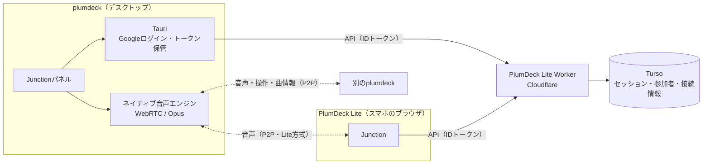
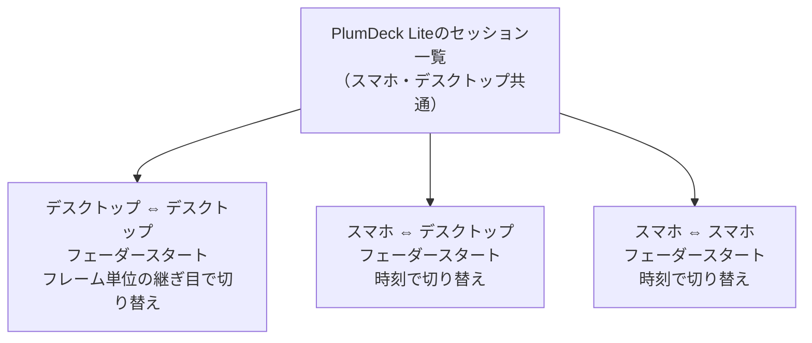
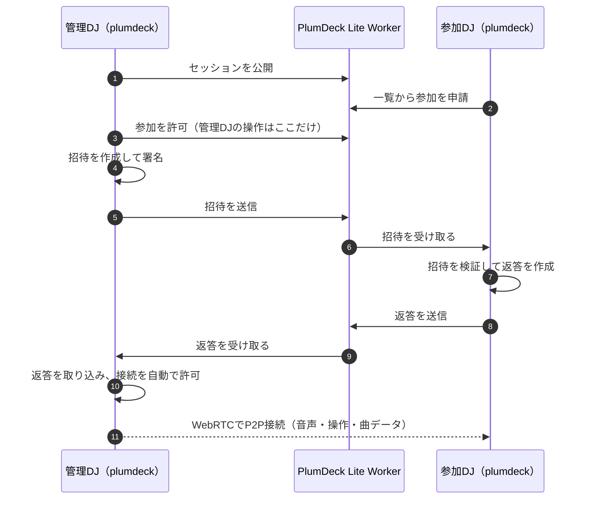

# plumdeck

ローカルの音楽ライブラリを整理し、選曲・DJプレイ・rekordboxの選曲補助に使うデスクトップアプリです。Tauri / React、FastAPI / DuckDB、Essentia / MusiCNN、Mixxx音声エンジンで構成しています。

plumdeck自身はLLMを呼び出しません。自然言語の解釈やジャンル分類の判断は、接続したMCPクライアントが行います。

## 操作ガイド

アプリの「解析」モードで、サイドバーの **Docs** を開いてください。機能別の日本語ガイド、説明用データによる画面キャプチャ、検索、画像の拡大表示を用意しています。

| 画面 | 主な用途 |
| --- | --- |
| Dashboard / Explorer | ライブラリの状況確認、音源の取り込み・解析 |
| Library / Tags | 曲の検索・試聴、曲情報・歌詞・ジャンルの編集 |
| Setlists / Wordplay | 曲順の作成、候補の確認、M3U8書き出し |
| プレイ | 2・4デッキ、波形、EQ、CUE、ループ、FX、サンプラー、録音 |
| アシスト | rekordboxのデッキを基準に次曲や目的地までのルートを探し、元音源をドラッグ |
| Junction（JCT） | DJセッションのメンバー・演奏順・接続状態を共有し、ブースと同じフェーダースタートで交代する |
| Workflow Tools | 音源修復、版管理、完全バックアップ、機器・USB・録音・Play取り込み |
| Settings / MCP | 音楽フォルダ、録音、CSV入出力、外部MCPクライアント接続 |


CSVとM3U8には音源ファイル自体は含まれません。音源の移動・バックアップは別に行います。Tagsのファイル反映は元の音源タグを更新します。

## Library Workflow Tools

解析モードの **Workflow Tools** には、ライブラリを壊さずに日常運用するための機能をまとめています。

- 音源参照は診断プレビュー後に更新し、track ID、解析結果、CUE、履歴を維持します。保存済みSHA-256と一致しない候補は自動確定しません。
- Original / Clean / Intro / Extendedなどの版をグループ化できます。セット内の同じ曲が複数回登場しても、指定したentryだけを差し替えます。
- セットのIN、OUT、一定の再生速度、追加時間、次曲との重なりから予定尺を計算します。並べ替えて隣接関係が変わった重なりは0へ戻ります。
- 完全バックアップはDuckDB、解析ジョブ、許可されたUI設定をmanifestとSHA-256付きで保存し、必要なら音源と録音も含めます。復元は検査、確認、staging移行、DBと解析ジョブのrollback保存を経て行います。復元中に終了した場合は次回起動時に両DBを復元前へ戻します。音源を含めなかったバックアップから音源本体は復元できません。TURN資格情報、キーチェーン、再生中の状態は含めません。
- 音声ルーティングは名前付きプリセットとして保存できます。読み込んだだけでは出力を変更せず、Playのオーディオ画面で接続機器のMaster/CUEチャンネルを選び、適用して確認します。現在は同一機器内の連続2チャンネル、44,100 Hz / 256 framesに対応します。
- DDJ-400の内蔵マッピングと、選択したMIDI機器から1操作ずつ取得するMIDI Learnに対応します。DDJ-1000固有の高速入力・表示フィードバックは他機器へ送りません。DDJ-400と汎用MIDIのLEDフィードバックは未対応です。
- USB一覧と安全な取り外しはmacOS／Windowsに対応します。WindowsではUSB接続のSSDも認識し、ドライブ文字が変わってもボリュームIDで識別します。USBはセットの固定snapshotとrekordbox XMLを作ります。rekordboxでXMLを取り込み、対象USBへExportしてから確認記録を残します。plumdeckはPioneerのUSBデータベースを直接生成・変更しません。実機確認は型番、firmware、日時、確認項目を伴う別の証拠です。
- 録音の長さはレコーダーの実フレーム数を使用します。曲目の区間は約20ms間隔のエンジン観測による推定で、細かなカットの完全な記録は保証しません。録音一覧からRange対応で試聴でき、外部録音はファイルから長さを検証して登録できます。
- Playの曲一覧からは、波形だけでなく各デッキのタイトル・ジョグ・操作部・余白にもドロップできます。ドラッグ中の「DECK A へロード」などの表示を確認してください。選択中のデッキに関係なく、落とした先のデッキだけへロードします。ミキサーやデッキ外へのドロップでは曲を置き換えません。ダブルクリックと一覧のロードボタンは選択中のデッキが対象です。
- Play画面へFinder／エクスプローラーから音源／フォルダをドロップできます。Collectionまたはドロップ時点のローカルプレイリストを追加先として固定し、元ファイルへタグを書きません。Rekordbox Mirror、履歴、録音へのドロップは拒否します。
- Play画面下部ブラウザの「Sampler」は、サンプラー用の音源一覧です。ライブラリの曲を「Sampler」へ、または音源ファイルを一覧へドロップして登録し、一覧からSAMPLERのPADへドラッグして割り当てます。通常の楽曲解析は行いません。
- Junctionで自分の順番が近づくと、ON AIRのDJの音がデッキ列の「J（JUNCTION MASTER）」に届きます。曲名・BPM・残り時間を表示し、LEVEL・EQ・クロスフェーダー割り当て・CUEで自分の曲へミックスできます。音源ファイルは転送しません。
- Explorerの解析とPlayへのドロップ取り込みは同じ解析枠を順番に使います。別の解析中にExplorerから開始した場合は拒否せず「開始待ち」として待機し、終わると自動で始まります。進捗は解析・プレイどちらの画面からも開け、再読み込み後も復元します。解析に失敗した曲は解析済みにせず、「Hide Analyzed」を外すと選び直せます。

USBのXML取り込み、CDJ/XDJ、任意のMIDI機器、各音声出力は環境依存です。自動テスト済みの状態と、rekordbox／実機で確認済みの状態は画面と検証記録で区別してください。

## 配布版の環境とMCP設定

Plumdeck本体のMCPは、起動中のアプリへHTTPで接続します。Python、ソースコード、開発者のホームディレクトリは不要です。接続先はアプリのMCP画面で確認してください。配布版の既定は `http://127.0.0.1:48123/mcp`、開発時は `http://127.0.0.1:8001/mcp` です。リポジトリの `.mcp.json` と `opencode.json` は配布版の接続例です。Junctionの操作も同じMCPから利用でき、別の音声エンジンは起動せず、画面と同じセッションを操作します。

rekordboxのDBを直接操作する `rekordbox-mcp` は別の任意ツールです。Plumdeck本体の利用に必須ではありません。必要な場合だけ、[導入手順](rekordbox-mcp/README.md)に従ってインストールし、クライアント側で登録してください。PATHで実行できる環境の設定例は次の通りです。

```json
{
  "mcpServers": {
    "rekordbox": {
      "type": "stdio",
      "command": "rekordbox-mcp",
      "args": ["--mode", "readonly"]
    }
  }
}
```

DBは実行ユーザーのmacOS／Windows標準保存先から自動検出します。独自の場所へ移している場合のみ `REKORDBOX_DB_PATH` を指定してください。GUIから起動したMCPクライアントのPATHにコマンドがない場合は、その利用者のインストール先をクライアントのローカル設定に指定します。個人パスを共有設定へコミットする必要はありません。

アプリのDBとログは `platformdirs` によるユーザー専用データディレクトリに保存します。`USER_DATA_DIR`、`DB_PATH` による明示指定は引き続き使用できます。音楽フォルダーの既定もOSのユーザーフォルダーです。録音変換と詳細波形は同梱FFmpegを使い、Windowsでは `ffmpeg.exe` を解決します。配布物が壊れている場合、開発機のツールへ暗黙に切り替えません。

起動時にポートが競合しても、別アプリのプロセスを終了しません。競合するアプリを確認して終了してから再起動してください。Plumdeck自身が起動したバックエンドはアプリ終了時に停止します。

Settingsの「解析方法」では、自動（Auto）・軽量（Light）・詳細（Full）を選べます。Windowsの自動解析はまず詳細解析を行い、タイムアウトした場合は軽量解析へ切り替えます。低スペックWindowsでは最初から「軽量」を選んでください。

軽量でも、再生・CUE・ループ・Beat Jump・SYNC・クオンタイズ・波形表示・類似曲検索・ジャンル候補・セットリスト推薦に必要なデータを生成します。音源全体を11.025kHzモノラルで読み込み、NumPyで拍を追跡します。キーと音色は最大30秒の代表区間、類似曲検索用のMusiCNNは曲中3区間・各約3秒を1区間ずつ解析します。実際の200次元特徴量を生成し、詳細解析と同じモデル・入力スペクトル仕様を使うため、両方の曲を一緒に検索できます。

省くのは機能ではなく解析の細かさです。軽量のキー・音色・推薦精度は詳細解析と異なり、急なテンポ変更や曖昧な拍ではグリッドの手動補正が必要な場合があります。全曲を一定BPMに強制せず、テンポが変わる曲は検出した拍列を保持します。詳細解析への更新も引き続き可能です。旧方式の軽量結果に特徴量がない曲は、もう一度取り込むと不足分を再解析します。保存済みの詳細解析・手動CUE・ループ・グリッドは軽量解析で消しません。

解析の進捗画面では、完了曲数・経過時間と、音源読み込み／BPM・キー推定／AI解析／保存など現在の工程を確認できます。起動時のローディングにも、サービス起動・設定・機能・データベース・取り込み状態の復元の進捗を表示します。

画面上部のツールバー「更新確認」、またはHelpメニューの「更新を確認...」から、現在のバージョンと最新版を確認できます。更新があれば「更新して再起動」で適用します。ダウンロード中は受信済み容量（全体サイズが分かる場合は割合も）を表示します。Junctionセッション中はインストール・再起動を行いません。

軽量経路はlibrosa・Numba・TensorFlowを読み込まず、JITコンパイルを行いません。ONNX RuntimeはCPU・1スレッドで使用します。5秒以上30分以内の音源を対象とし、曲ごとのワーカーには180秒の最終上限を設け、停止時も次の曲を再試行可能にします。Windows配布版では、Tauri管理下の凍結サーバーから `multiprocessing.spawn` を呼ばず、許可した解析処理だけを実行する専用サブコマンドを起動し、進捗・結果・エラーをJSONで受け取ります。拍や特徴量が不足する結果は「解析済み」として登録しません。

曲名・アーティストなどの表示メタデータと、BPM・グリッド・波形・埋め込みなどの音響解析結果は別々に判定します。ID3タグが空でも音響解析が成功していれば結果を保存し、曲名はファイル名、取得できないアーティストは `Unknown` として後からTagsで修正できます。メタデータ不足だけを理由に同じ音響解析を繰り返しません。

macOSでは従来どおりEssentiaによる詳細解析を維持し、「軽量」は選択できません。Windowsの詳細解析はFFmpeg・librosa・ONNX RuntimeでBPM／キー／音色／波形／MusiCNN埋め込みを解析します。MusiCNNのモデルと入力スペクトル仕様は共通です。BPM・キーの推定アルゴリズムにはOS差があるため、解析履歴には使用したコンポーネントのバージョンを記録します。

Release workflowは両OSでネイティブ音声エンジンをビルドし、必要なDLL／Frameworkとバックエンドを同梱します。Windows distribution validationでは、通常のPATHを外した同梱exeの診断に加え、インストール済みTauriアプリを起動し、タグなし音源を実際の `/api/ingest` から軽量解析します。解析ワーカー到達後の進捗、完了、エラー0を確認できないビルドは配布しません。音声デバイス、DDJ本体、rekordboxのUIとの実機検証はこのCIとは別です。

## ローカル開発

フロントエンドはNode / pnpm、デスクトップはRust / Tauri、バックエンドはPython環境を使います。ネイティブ音声エンジンのビルド対象はmacOS / Apple SiliconとWindows x64です。ブラウザだけでは音声エンジン、MIDI、rekordboxデッキ取得、外部アプリへのドラッグは利用できません。

```bash
cp .env.example .env
pnpm install
pnpm backend:install
pnpm tauri
```

環境ごとの値はGit管理外の `.env` で変更します。本番用の環境ファイルが必要な場合は、`.env.production.example` を `.env.production` へコピーしてください。exampleファイルには共有可能な既定値だけを置き、認証情報や端末固有のパスは追加しません。

個別に起動する場合は `pnpm backend:dev` と `pnpm dev` を使います。開発時のバックエンドは通常 `127.0.0.1:8001`、フロントエンドは `127.0.0.1:1420` です。APIの参照先は `src/services/api-client.ts` と環境変数に集約しています。

```bash
pnpm build
pnpm test:backend
node --experimental-strip-types --test native/dj-engine-host/tests-node/*.test.ts
cargo test --manifest-path src-tauri/Cargo.toml --lib --locked
```

音源・DB・モデル・ビルド成果物・認証情報はGitへ含めません。永続的な操作説明と開発上の前提はREADME、アプリの使い方はDocsへ置きます。一時的な調査報告、設計メモ、検証出力、サンプルのM3U8やキャプチャはリポジトリ外に保存します。実行可能な回帰テストと、そのテストが必要とするフィクスチャは保持します。

## Mixxx音声ホスト

`native/mixxx-engine-host` が音声エンジンです。固定したMixxxのソースへアダプターを組み込みます。依存ソースの変更はビルド時に生成するヘッダー等へ限定し、取得した上流チェックアウトを直接編集しません。

```bash
pnpm dj-engine:build
pnpm dj-engine:stage
pnpm tauri:build:performance
```

WindowsではVisual Studioの「x64 Native Tools Command Prompt」でビルドします。Python 3.11、Git、Node 24、Rust、CMake、Ninjaが必要です（`python -m pip install cmake ninja`）。依存ソースとWindowsライブラリは固定リビジョン／ハッシュから取得し、DLL・Qtプラグイン・リソースをステージへまとめます。Windows利用者側にVisual Studio、Python、WSL、Homebrewは不要です。

Apple Siliconでは `/opt/homebrew` のARM64ツールチェーンを使用します。依存バージョンは `native/mixxx-engine-host/dependency-versions.json`、固定リビジョンと取得処理はビルドスクリプトにあります。Mixxxホストを含む配布では、同梱ライブラリ・署名・対応ソースの確認も必要です。

```bash
bash native/mixxx-engine-host/scripts/package-corresponding-source.sh
```

このスクリプトは固定されたMixxx、GSL、libdatachannelとサブモジュール、Opus、libnice、SoundTouch、RubberBand、libsamplerateのソースとplumdeck側のアダプター・ビルド手順をまとめます。実行には依存ソースの取得とネットワーク接続が必要です。

### DDJ-1000・音声出力

プレイ画面の「オーディオ」で出力を選択します。DDJ-1000はMASTERにUSB 1/2、ヘッドホンCUEにUSB 3/4を使います。本体のUSB A/B切替を接続先に合わせてください。MIDIの接続・ジョグ移動量・再接続はプレイ画面上部のDDJ-1000設定から行います。

出力デバイスの変更では再生・録音を停止してデッキを解除します。マイクはMasterと録音へ入り、ダッキングはDJ音を下げます。録音の保存形式・保存先はSettingsで変更します。

MIDIアドレスの照合データは `native/dj-engine-host/tests-node/fixtures/ddj1000-midi-map.json` に置いています。ジョグ表示の実装は `src-tauri/src/dj_engine/jog_display.rs` です。MIDI/HIDの送信数だけで実機の点灯や表示を確認したことにはしません。

## Junction（JCT）

JCTは複数のDJが一つのセッションへ参加し、ブースでの交代と同じ手順でプレイをつなぐ機能です。参加者は表示名ではなくDJ名で扱い、任意のアイコンと色を設定できます。全員に同じ「DJ一覧」を表示し、招待を作った時点では相手を招待中の枠として追加します。返答を取り込んで接続すると、その枠が実際のDJ情報と接続状態に置き換わります。各行では参加待ち・接続済み・プレイ中などの状態と通信品質を確認できます。管理DJの接続操作は相手の行、参加DJ自身の操作は一覧の上の「あなたの接続」に表示します。接続は「①招待 → ②返答 → ③接続」の順で案内し、コピー後は次の操作へ進みます。「その他」メニューは項目選択・外側クリック・Escで閉じます。

セッションを作成したDJ（ホスト）が会場出力と順番を管理しますが、最初にプレイする必要はありません。DJ一覧はタイムテーブルで、ホストはドラッグで順番を変更し、「最初のDJにする」で開始します。開始前に「セッション設定」で会場への音声出力デバイスを反映してください。未設定のまま開始しようとすると理由を表示し、一覧の順番は変えません。

交代はフェーダースタートです。順番で次に当たるDJのプレイ画面は信号が **STANDBY（黄）** になり、ON AIRのDJの音がJUNCTION MASTER（J）に届きます。自分のデッキで曲を用意してCUEで合わせ、条件がそろうと **READY（緑）** になります。READYでフェーダーを上げる（マイクをONにする、Jを動かすのも同じ）と、その瞬間に **ON AIR（赤）** になります。承認ボタンはありません。READYでないときは理由を1行で表示し、本番には出しません（例：「一度フェーダーを下げてください」）。保険として「今すぐON AIR」ボタンもあります。

前のDJは **OUTGOING（灰）** になり、交代の瞬間に鳴っていたデッキだけを固定の音量で送り続けます（マイクやJは送りません）。そのデッキはループ以外を操作できず、ほかのデッキは自由に準備できます。新しいDJがJを下げ切って1.5秒たつか、残りの曲が止まって3秒無音になると解放され、次のDJのSTANDBYが始まります。参加者は「順番に入る／外れる」とブースの合図（あと1曲・次どうぞ・少し待って・OK）を使えます。ホストはB2Bの繰り返し、強制交代・スキップ・強制解放、ON AIRのDJが切断したときの自動交代を設定できます。


音声はWebRTC / Opusで送り、ホストの独立したProgram出力から1秒の遅延付きで配信します。遅延はセッション中に変えません。ヘッドホンCUE・プライベート試聴はProgramへ混ぜません。MASTERつまみは各DJのブース音量で、会場の音量は変わりません。音はホストを中心に流れ、ゲスト同士は直接つながりません（前のDJ → ホスト → 次のDJのJ、次のDJ → ホストの待機音声）。会場出力は、次のDJが「Jだけが鳴っていた地点」を自分の音声で測って知らせ、ホストがそのフレームで前のDJの音から切り替えるため、途切れも二重再生もしません。PlumDeck Liteが絡む交代は時刻で切り替えます。

デッキ・サンプラー・FXの状態を別のDJへ複製する方式と音源の転送は、交代には使いません。ホストの障害復旧（ON AIRのDJの音が途切れたときにホストの手元の演奏へ切り替える）は従来どおり使えます。

### 手動で接続する（既定）

招待・返答の文字交換に、運営のシグナリングサーバーやアカウント、課金認証は不要です。管理DJが「セッションを作成」し、DJごとに招待用の文字を作ります。参加DJは招待を確認して返答を作り、管理DJがその返答をDJ一覧の該当行へ取り込んで接続を許可します。招待・返答はコピーしてチャットで受け渡します。ファイルによる取り込み・保存はありません。コピーしただけでは送信されないため、普段のチャットなどで相手へ渡してください。

音声・操作と楽曲転送の2つの接続について、ICE候補が揃うまで共有できません。招待は15分有効（持ち込み資格情報が先に切れる場合はその期限まで）です。返答の取り込みと承認は別操作で、接続や再交換だけでは演奏権は移動しません。パネルを閉じても演奏と接続は続きます。

招待・返答の文字はどのサーバーも経由しません。一方、音声・データの接続では既定で公開STUNを直接接続先の探索に使います。相手とのメディア接続だけが直接つながらない場合に限り、管理DJが「直接つながらないときの中継設定」に自分のTURNを設定できます。つまり「運営のサーバーやアカウントは不要」ですが、「外部サーバーを一切使わない」わけではありません。plumdeckとして運営する接続サービスやTURNは提供していません。

TURN RESTの共有シークレットはネイティブ内に保持し、保存を選ぶとmacOSキーチェーン、WindowsではログインユーザーのDPAPIで暗号化して保管します。招待へ渡すのは参加者ごとに発行する30分有効の接続用資格情報だけです。発行済み一時資格情報も、期限を示すTURN REST形式のユーザー名と24時間以内の期限で利用できます。期限切れの資格情報を再使用しません。設定変更・更新後は同じDJの招待を作り直して再交換します。管理用APIキーや長期秘密鍵を招待・返答へ入れません。接続テストは実際の中継候補取得を確認しますが、相手との接続や全回線での成功を保証するものではありません。

数秒の通信停止は切断扱いにせず、10秒以上制御通信が途切れた場合も接続情報を破棄せずに同じ接続への自動再接続を続けます。待機中の楽曲転送経路は定期的に維持し、その一時的な不調だけで音声・操作やロビーの参加状態を切断しません。WebRTCが復旧不能と確定した場合、または実際の楽曲転送が失敗した場合だけ、管理DJがDJ一覧の同じ行で「再接続の招待を作る」を押し、参加DJが「あなたの接続」の「新しい招待を入力」で受け取ります。参加DJは新しい返答を送り、管理DJが同じ行で返答を確認して接続を許可します。古い招待・返答は使えません。セッションを作り直す必要はありません。他のDJの接続と演奏権は維持します。取り消し・拒否をオフラインの相手に知らせる場合は、署名付き通知をコピーして渡します。DJ名やアイコンだけでは本人確認できないため、招待と返答は相手を確認できる経路で受け渡してください。

### PlumDeck Liteのメンバーと接続する

PlumDeck Liteに登録済みのGoogleアカウントでJunctionパネルからログインすると、PlumDeck Liteのセッション一覧（スマホ・デスクトップ共通）からセッションを作成・参加できます。招待・返答の文字をコピーする必要はなく、人の操作は「参加を申請」と「参加を許可」だけです。登録していない相手とは、ログイン中でも上記の手動方式で接続でき、同じセッションで両方を併用できます。同じGoogleアカウントでも、PCとスマホ、2台のPCはそれぞれ別の参加者として扱います。



Workerとデータベースは、セッション一覧・参加申請・承認と、接続情報（招待・返答・WebRTCのSDP）の受け渡しだけを担います。音声・演奏データはサーバーを経由せず、接続後にP2Pで流れます。

参加者の組み合わせごとに、両方ができる方式を自動で選びます。



デスクトップ同士の接続の流れです。招待と返答はネイティブが作成・署名・検証し、Workerは中身を解釈せずに宛先の相手へ渡すだけです。



承認済みの参加者から届いた、自分が送った最新の招待への返答だけを自動で許可します。手で貼り付けた返答は、これまでどおり管理DJが確認して許可します。再接続が必要な場合も、管理DJが「再接続の招待を作る」を押すだけで自動で届きます。

ログインはシステムのブラウザで行い、`127.0.0.1` の一時ポートで結果を受け取ります。リフレッシュトークンはmacOSキーチェーン／Windows資格情報マネージャーに保存し、画面側（WebView）へトークンを渡しません。ログアウトすると削除します。PlumDeck Lite WorkerのURLはソースに含めず、ビルド時の環境変数 `PLUMDECK_SHARE_MUSICS_URL`（リリースではGitHubのSecret）から埋め込みます。未設定でビルドした場合はPlumDeck Liteのログインを表示せず、手動の招待・返答だけで動作します。ローカルでビルドするときも同じ変数を設定してください。開発ビルドでは実行時に同じ変数でローカルのWorker（`wrangler dev`）を指定することもできます。

スマホとデスクトップの間は、1本の双方向ブラウザ互換WebRTC接続（Opusステレオ音声と`junction.control` DataChannel）を使います。交代の状態・順番・合図は同じ語彙（機能フラグ `junction-fader-start-v1`）でやり取りし、対応していない相手には「相手のアプリを更新してください」と表示して交代させません。Jへ届けるのは送り手のデッキの音（Jとマイクを含まないバス）だけで、受け手の音をその送り手へ返さないためフィードバックしません。

### 既存の接続サービス（開発用の別方式）

従来のサーバー方式はネイティブAPIの明示的な `exchangeMode: "server"` と接続URLで利用できます。通常UIの手動接続はこのサービスを起動せずに動作します。構成は [接続サービスのREADME](services/junction-signaling/README.md) を参照してください。

初回のローカルネットワーク接続はmacOSの案内に従って許可します。設定は「システム設定 → プライバシーとセキュリティ → ローカルネットワーク」で確認できます。開発用のad-hoc署名はmacOSで識別が安定しない場合があるため、配布時にはApple発行の署名で直接接続も確認します（[Apple TN3179](https://developer.apple.com/documentation/technotes/tn3179-understanding-local-network-privacy)）。

招待には参加情報が含まれます。管理DJが参加者を承認し、必要に応じて招待を再発行します。招待・復旧シークレット・TURN共有シークレットはログやGitへ残しません。

### 検証

```bash
native/mixxx-engine-host/build-junction/junction-core-tests
native/mixxx-engine-host/build-upstream/junction-fx-tests
pnpm junction:test:manual
pnpm junction:test:integration # 既存サーバー方式の回帰試験
```

実音声の統合試験は、ビルド済みのmacOSホストとステレオのループバックデバイスを使います。既定のデバイスはBlackHole 2chです。`PLUMDECK_MIXXX_OUTPUT_DEVICE` で変更できます。実音声の試験は同じデバイスを奪い合わないよう直列で実行します。

手動方式は `pnpm junction:test:manual` で3プロセスを起動し、招待・承認・取消・フェーダースタートの交代（最初のDJ、ゲスト→ホスト、ホスト→ゲスト、ゲスト→ゲストの中継）・残りの曲の解放・再交換とProgram音声を検証します。`JUNCTION_TURN_ADDRESS=127.0.0.1:3478?transport=tcp`、`JUNCTION_TURN_SECRET_FILE`、`PLUMDECK_JUNCTION_FORCE_RELAY=1` を指定すると持ち込みTURNを検証します。テスト時は `PLUMDECK_JUNCTION_EPHEMERAL_NETWORK=1` で実際のキーチェーンに触れません。

既存サーバー方式の統合試験には次の追加条件があります。

- `PLUMDECK_JUNCTION_TEST_DECKS=4`：交代前のホストで4デッキを鳴らす。
- `PLUMDECK_JUNCTION_TEST_SAMPLER=1`：交代前のホストでサンプラーを鳴らす。
- `PLUMDECK_JUNCTION_TEST_FX` / `PLUMDECK_JUNCTION_TEST_COLOR` / `PLUMDECK_JUNCTION_TEST_PAD`：効果名を指定。
- `PLUMDECK_TEST_HOST`：パッケージ内など別のホスト実行ファイルを指定。
- `PLUMDECK_JUNCTION_TEST_TURN_TTL=8`：短いTURN認証期限で、更新後の参加・交代を確認。
- `JUNCTION_TURN_ADDRESS` / `JUNCTION_TURN_TLS=1` / `JUNCTION_TURN_SECRET_FILE` / `PLUMDECK_JUNCTION_FORCE_RELAY=1`：用意したTURN経由で接続。

### 現在の制約

READYの判定には、Jの受信が1秒以上安定していること、回線の遅延が会場の遅延の半分（500ms）に収まることが必要です。遅い回線ではREADYにならず、理由を表示します。PlumDeck Liteが絡む交代は時刻で切り替えるため、前のDJの音が一瞬重なることがあります。

手動方式は短い通信断からの復帰と参加者単位の再交換に対応しています。IP変更やスリープ復帰で既存候補が使えなくなった場合は、新しい招待・返答が必要です。実際のWi-Fi／テザリング切り替えなどは別回線での確認が必要です。

同一Mac上の複数プロセス、実音声Program、TURN TCP/TLSでの試験と、別Mac・別回線・実機の検証は区別してください。2台のMac・異なるインターネット回線・DDJ実機・実配信、8人の大容量転送、2時間の連続運用は未検証です。現時点ではこれらの条件を満たす本番運用の保証はしていません。

## グリッド・CUEの時刻と再解析

解析した拍位置は、スペクトル窓から推定した時刻をそのまま使用せず、各拍の近傍にある明瞭な音の立ち上がりに合わせます。一定のミリ秒数を全曲へ加減する方式ではありません。テンポ変化を含む拍列は保持し、一定テンポへの整形は全曲の残差が小さい場合だけ行います。小節頭の自動判定を保証するものではありません。

既存データは **Settings → グリッドを一括再解析 → 対象を確認 → 一括再解析を開始** で更新できます。既存の永続的な選択再解析キューを使用し、BPMと拍位置だけを計算します。対象選択時も全曲の波形・AI特徴量をメモリーに読み込みません。「未更新の曲だけ」、一時停止、続きから再開、失敗曲の再試行に対応します。解析由来の保存済みグリッドも更新しますが、手動・rekordbox由来の保存済みグリッド、CUE・ループ、未選択の特徴量は保持します。編集画面との競合はrevisionで検出します。読み込み済みデッキへの反映には、曲を読み込み直してください。

Transition Editの手動補正では、**GRID → BPM変更範囲「変更地点から先」→ 現在位置を変更地点に → 後半のBPMを入力 → 保存・適用** と操作します。前の拍を動かさず、変更地点から曲末まで指定BPMの間隔を保存します。複数の変更地点は手前から順に設定します。再生中のテンポ再推定や、曲全体のBPM表示の自動変動を追加する機能ではありません。

rekordbox取り込みは、同梱Mixxxのデコーダーに合わせてMP3のエンコーダーヘッダー別に時刻を補正します（macOS: CoreAudio、Windows: MAD）。macOSのM4AはAACのみを補正し、ALACは補正しません。基準は[固定したMixxxリビジョンのrekordbox補正](https://github.com/mixxxdj/mixxx/blob/3ebac449e7e5fe2a0186596657696e87ce8b0e56/src/library/rekordbox/rekordboxfeature.cpp)です。CUEとPQTZグリッドを同じ時間軸にそろえ、再取り込みでも補正を重ね掛けしません。元音源とrekordboxのDBは書き換えません。旧版の取り込み済みCUEは再取り込み、保存済みrekordboxグリッドはGRIDの「rekordboxから読込」で更新します。手動修正と区別できないCUEを起動時に自動移動することはありません。

回帰テストは、既知の拍位置を持つクリック・キック・裏拍・テンポ切替の音源、MP3ヘッダー分類、CUEの単曲／一括取り込み、手動編集との競合、BPM区間編集と保存を対象にしています。合成音源の誤差測定と、ユーザーの実音源・実機での一致は別の検証です。

## rekordboxアシスト

macOSのアクセシビリティ、WindowsのUI Automationから、rekordboxが表示しているデッキの曲情報を読み取ります。macOSでは初回の案内に従ってplumdeckのアクセシビリティを許可してください。Windowsでは両アプリを同じユーザー・権限で起動し、rekordboxのPERFORMANCE画面を表示します。Windows標準のPowerShell／.NETを使う読み取り処理は、時間と出力量を制限した別プロセスで動きます。OCRや画面録画は使用しません。

「グルーヴ」「展開」「ワードプレイ」、エネルギーの方向、ジャンル条件を選んで候補を探します。現在の基準デッキは手動で選択します。ロードを確認した曲は履歴へ保存し、候補から除外します。新しいセットでは履歴をリセットできます。目的曲をもう一方のデッキまたはライブラリ検索から指定すると、アシスト内に中継曲を含むルートを表示できます。目的曲そのものは置き換えず、条件に合うルートがない場合はその理由を表示します。

確認済みの画面構成はrekordbox 7.2.18の2Deck Horizontalです。同名曲などで一意に照合できない場合は未確認として表示します。アシストへの切り替えではplumdeckの音声とコントローラー接続を解放します。

`src-tauri/vendor/drag` はdrag 2.1.1を同梱しています。macOSの外部Copyドラッグで `NSDragOperationCopy | NSDragOperationGeneric` を許可し、JUCEがGenericを返す場合に対応する変更があります。Copy操作に移動・削除は追加していません。上流のApache-2.0 / MITライセンスは同ディレクトリに保持しています。

## MCP・データ操作

アプリのMCP画面に表示されるURLでStreamable HTTPに接続します。通常の製品ビルドは `http://127.0.0.1:48123/mcp`、開発時は `http://127.0.0.1:8001/mcp` です。現在は96ツール（うちJunction 50ツール）を登録し、実際の一覧は起動中のサーバーで確認できます。

Junctionでは、状態・交換テキスト・音声機器・STUN/TURNの確認、セッション作成／参加、招待と承認、DJ順、開始、順番に入る／外れる、B2Bの繰り返し、今すぐON AIR、強制交代・スキップ・残りの曲の解放、ブースの合図、切断時の自動交代、復旧、Program出力と録音、プライベート試聴、マイクに加え、JUNCTION MASTERのLEVEL・EQ・L/THRU/R・CUE・解放を操作できます。廃止した引き継ぎ要求・取消・受諾のツールは理由をエラーで返します。MCPサイドカーは起動ごとに生成する認証情報でTauriのループバック専用ブリッジへ接続し、画面と同じネイティブ音声エンジンだけを使います。一般の状態取得では交換テキスト、TURN資格情報、ローカルパス、アイコン画像を返しません。招待・返答・通知は、それを生成する明示的な操作の結果でだけ返します。

AIエージェントには、初回だけ `junction_prepare_engine`、続いて `junction_get_state` を呼び、状態とpeer IDを確認させます。招待・返答は非同期で準備されるため、作成後に `junction_get_exchange_text` を使って取得します。操作後も状態を再取得させてください。参加の承認・拒否、セッション開始、強制交代、残りの曲の解放、録音開始、退出、終了は実際の音声や参加者へ影響するため、対象と実行意図を明示して依頼します。

リポジトリ同梱の `.mcp.json` と `opencode.json` は端末固有の絶対パスを保持しません。Claude CodeまたはOpenCodeを起動するシェルで、rekordbox MCPの実行ファイルとデータベースを環境変数に設定してください。

```bash
export REKORDBOX_MCP_COMMAND="$HOME/.local/bin/rekordbox-mcp"
export REKORDBOX_DB_PATH="$HOME/Library/Pioneer/rekordbox/master.db"
```

`rekordbox-mcp` が `PATH` にある場合、Claude Codeでは `REKORDBOX_MCP_COMMAND` を省略できます。OpenCodeでは設定ファイルの変数展開時に未設定値が空文字になるため、起動前に設定してください。

- あいまいな選曲条件はクライアント側でBPM・Energy等の条件に変換し、検索へ渡します。
- 書き込みには検索で取得したtrack id / setlist idを使います。名前から存在を仮定しません。
- ジャンルは文脈取得後にクライアントが判断し、構造化した結果を適用します。
- 音響再解析は影響範囲を確認して開始し、既存タグを保持する設定を優先します。
- ワードプレイは歌詞を読んで提案し、承認と実際の試聴確認を区別します。
- セットリスト、分類、解析ジョブはUIと共有する永続状態です。同じ対象へ複数の処理が並行して書き込まないようにします。

rekordbox MCPの起動・DBモード・操作手順は [rekordbox-mcp/README.md](rekordbox-mcp/README.md) にあります。plumdeckに同梱した接続設定は読み取り専用です。

## ブランチ・配布

`main` を配布の基点とし、変更は `feature/*`、`fix/*`、`refactor/*`、`chore/*` で進めます。ブランチのプッシュと製品リリースは別の操作です。

`pnpm package` はこのOSのバックエンド・ネイティブ音声エンジン・Tauriインストーラーをローカルで作成します。公開操作は行いません。タグをGitHubへプッシュするとRelease workflowが両OSの配布物を作成します。`pnpm release vX.Y.Z` は既にプッシュしたタグのRelease workflowをGitHub CLIで再実行します。通常の開発確認では実行しません。配布物は [Releases](https://github.com/Yutahhhhh/plumdeck/releases) で確認してください。対応OS・アーキテクチャ・署名状況は実際に配布されたファイルに従います。

## ライセンスと対応ソース

Mixxx音声ホストはMixxx 2.5.6のコミット `3ebac449e7e5fe2a0186596657696e87ce8b0e56` を利用し、GPL-2.0-or-laterの条件で配布します。plumdeckのアダプターとビルドスクリプトも対応ソースの一部です。プロセスを分けることをライセンス適用の免除とは扱いません。

JCTではSoundTouch 2.4.1、RubberBand 4.0.0、libdatachannel、libnice、Opus等を使用します。SoundTouchとRubberBandの状態移送用ビルドには上流のライセンス条件が適用されます。固定ソース・ビルド構成・変更用スクリプトは対応ソースのアーカイブへ含めます。Qtなど動的リンクのライブラリについては、互換ビルドへの置き換えを妨げない構成を維持します。

同梱物のライセンスはステージ済みホストの `Contents/Resources/licenses` に置きます。対応ソースのアーカイブには固定依存ソース、アダプター、ビルド環境・Homebrewメタデータ・同梱ファイルの一覧を含めます。

- [Mixxxのライセンス](https://github.com/mixxxdj/mixxx/blob/2.5.6/LICENSE)
- [Mixxxのソース](https://github.com/mixxxdj/mixxx/tree/2.5.6)

RustのシミュレーターはMixxxコードを含まず、依存バージョンは `native/dj-engine-host/Cargo.lock` で固定しています。

Release workflowはmacOS／Windowsのビルドと検証が両方成功した後に、インストーラーと署名付き `latest.json` を公開します。更新用のGitHub Actions Secretsには `TAURI_SIGNING_PRIVATE_KEY` と、鍵にパスワードがある場合は `TAURI_SIGNING_PRIVATE_KEY_PASSWORD` を登録します。秘密鍵は既存の `tauri.conf.json` の公開鍵と対になるものを使い、利用者の環境へ配りません。不一致・未設定・タグとアプリバージョンの不一致は公開前にエラーにします。macOSの更新アーカイブはネストした音声エンジンの最終署名処理後に作ります。

自動更新のURLは一般利用者が認証なしで取得できるHTTPS配布先である必要があります。非公開リポジトリのまま配布する場合は、公開の配布先を用意して `plugins.updater.endpoints` と Actions Variable `PLUMDECK_RELEASE_DOWNLOAD_BASE`（末尾は `/releases/download` 相当）を設定し、生成された配布物を同じURLへ配置してください。AppleのDeveloper ID署名・公証、およびWindowsの発行元署名に使う証明書は、更新ファイルの署名鍵とは別の発行者設定です。

Junctionの画面操作確認用に、`pnpm dev` で `/tests/ui/junction.html` を開けます。テスト用の状態を切り替えて手順・メニュー・新しい招待でのリセットを確認します。音声エンジンへの接続は行わないため、実際の通信確認には上記のネイティブテストを使用してください。

開発を応援いただける方は、[Ko-fi](https://ko-fi.com/yutahhh)をご利用いただけます。アプリ内でもサイドバー下部の「開発を応援」から開けます。
