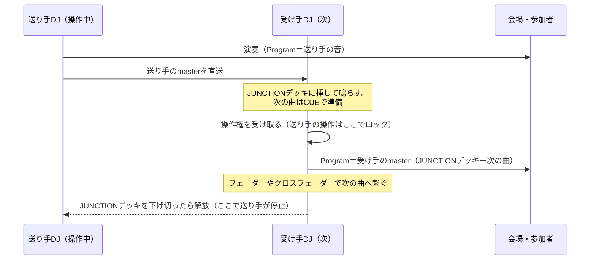
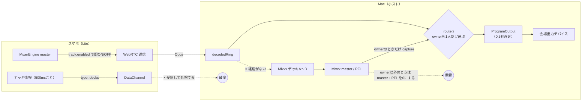
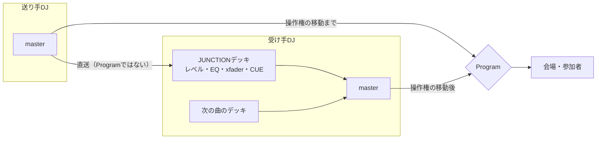
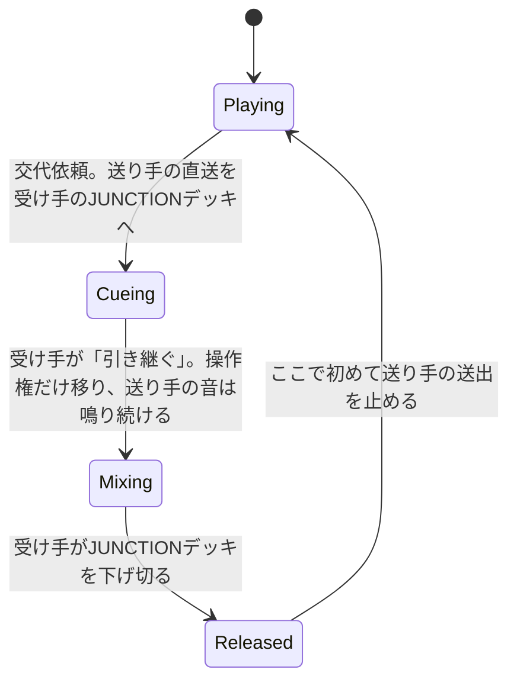
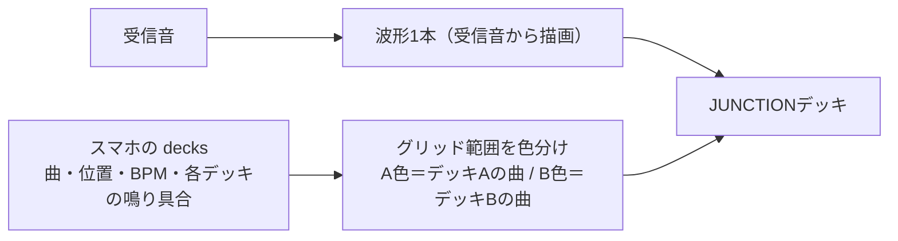

# Junction × PlumDeck Lite：B2Bフローの課題と改善策

対象: plumdeck（Macホスト）＋ share-musics（PlumDeck Lite／スマホ）。調査日 2026-09-15、改訂 2026-09-16。

## 1. 目指すDJフロー

**操作するのは常に1人だけ。前の人の曲は、受け手のデッキ（JUNCTIONデッキ）に挿して鳴らし続け、受け手が音量やクロスフェーダーで次の曲へ繋ぐ。**

操作権の移動と、送り手の音の停止を分けて扱うのがポイントです。操作権は一瞬で移しても構いませんが、送り手の音は受け手が下げ切るまで鳴り続けなければなりません。

## 2. 現状の音声経路（スマホがプレイ中、Macがホストのとき）

## 3. 問題一覧（根本原因）

| # | 症状 | 根本原因 | 該当箇所 |
|---|---|---|---|
| 1 | 「招待を準備しています。できあがるとPlumDeck Lite経由で相手に届きます。」から変わらない | Liteピアの行にも手動招待用の `exchange` が付いたままで、状態が `idle` から更新されない（Liteは別の経路 `liteSdp` / `hello` で接続する）。同じ画面の公開パネルでは「スマホと接続しました」と出ており、表示が食い違う | `runtime.cpp:305`, `:111` / `JunctionRoster.tsx:210` / `exchange-actions.ts:75` / 比較: `ShareMusicsJunction.tsx:224` |
| 2 | 送られてきた音をデッキに挿せない | 受信した音はMixxxに入らず、`route()` から ProgramOutput へ直行する。デッキにロードできるのはファイルパスだけ | `runtime.cpp:1249-1255`, `:1370` / `host.cpp:502-504` |
| 3 | スマホがプレイ中、Macで次の曲を準備できない | owner以外はデッキやミキサーの操作が拒否され、UIでもロードを止めている。さらに **PFL（ヘッドホン）まで0** になる | `authority.cpp:15` / `PlayWorkspace.tsx:284` / `mixxx_backend.cpp:344-346` |
| 4 | 交代した瞬間に前の音がバッサリ切れる | 操作権の移動と音の停止が一体になっている。Liteが関わる交代では `selectLiteOwner()` が即座に切り替え、`programPending.clear()`・キャプチャ停止・epoch++ で旧ownerの音を捨てる。スマホ側も同時に `track.enabled=false` にする | `runtime.cpp:493-503`, `:1703` / `peerConnection.ts:106` / `MixerEngine.ts:196-207` |
| 5 | 次のDJ（スマホ）がMacの音を受け取れない | Mac→LiteのWebRTC回線が受信専用（RecvOnly） | `media_transport.cpp:157` |
| 6 | スマホで何の曲をかけているかがMacに出ない | スマホが500msごとに送る `decks` をMacの `liteControl` が捨てている。Lite側も「デッキA＝現在」「デッキB＝次」と固定で割り当て、`audibility` を常に1にしている | `runtime.cpp:509-510` / `share-musics DjPlayPage.tsx:239`, `JunctionPanel.tsx:219` |
| 7 | 前の曲と次の曲が2枚に分かれて表示され、意味が分かりにくい | Junction Liveを「現在」「次（先読み）」の2枚のカードで見せる設計になっている。しかも表示専用で、音はデッキに入らない | `JunctionTrackList.tsx:17-20` / `PlayWorkspace.tsx:346-356` |
| 8 | 仕様そのものが「1人ずつ切り替える」前提 | FR-29「MASTER OUTへ出すのは常にowner 1人分」 | `share-musics/docs/requirements.md:75,98` |

補足: Mac同士の交代はデッキ状態（graph）ごと引き継ぐので、今でも音は切れません。問題が起きるのはLiteが関わる経路だけです。

## 4. 改善方針

### 4.1 JUNCTIONデッキ

送り手の直送音を、受け手の**デッキ枠の1つ**として扱います。

| 側 | できる操作 | 実体 |
|---|---|---|
| Mac（受け手） | レベルフェーダー、EQ、クロスフェーダーへの割り当て、CUE（PFL）。ライブ音なのでピッチ変更とシークはできない | Mixxxの `EngineAux`（`[Auxiliary1]`）をデッキ枠に表示する。`decodedRing` を分岐（tee）→ ジッタバッファ → ASRC → `receiveBuffer` |
| スマホ（受け手） | レベルフェーダーとクロスフェーダーだけ | `MixerEngine` に MediaStreamSource＋GainNode のチャンネルを追加する |

### 4.2 交代の段階

**継ぎ目の合わせ方**

- **スマホ→Mac**: JUNCTIONデッキのバッファ遅延は自前で決める値なので、既知です。Program側の直送音を同じだけ遅らせてから継げば、相関計測は不要です（見込み）。
- **Mac→スマホ**: スマホは波形で確認できないので、多少のズレは許容します。位置合わせはせず、切り替えの瞬間に短いフェードをかけるだけにします。

### 4.3 JUNCTIONデッキの表示（1本に統合）

「現在再生中」「次の曲（先読み）」の2枚を廃止し、JUNCTIONデッキの波形1本にまとめます。

- 波形は受信したPCMから描きます。スマホ側の曲ファイルは不要です。
- どの範囲が前の曲でどの範囲が次の曲かは、グリッド上の範囲の色で表します。色の判定には、スマホから届くデッキごとの鳴り具合（`レベル × クロスフェーダー`）を使います。そのため、Lite側で固定値になっている `audibility:1` を実際の値に直す必要があります。
- グリッドは、優勢なデッキのBPMと位置から引きます。

## 5. ロードマップ

| 優先 | 内容 | 主な変更点 | 規模 |
|---|---|---|---|
| P0 | 招待表示のバグ修正 | Liteピアには手動の `exchange` を付けない（または `hello` から `connected` を返す）。Roster側もLiteの行は `participant.status` で表示する | 小 |
| P0 | 交代で音を止めない | `selectLiteOwner` から `programPending.clear()` と即時停止を外す。スマホ側は操作権を失っても、解放されるまで送出を続ける（ロックするのは操作だけ） | 小〜中 |
| P1 | スマホのプレイ中もMacで準備できるようにする | ownerがLiteのとき、Macのデッキ操作を「ローカル準備」として許可する。PFLは0にしない（会場へのmasterは引き続きミュート） | 小〜中 |
| P1 | 曲情報を受け取る | `liteControl` で `decks` を受け取る。Lite側は `audibility` を実際の値（レベル×xfader）にし、現在／次の固定割り当てをやめる | 小 |
| P2 | MacのJUNCTIONデッキ（スマホ→Mac） | `EngineAux` の登録と、tee→ジッタバッファ→ASRC の実装。デッキ枠のUI（レベル・EQ・xfader・CUE）と、1本の波形＋範囲の色分け。MCPにも操作を追加する | 大 |
| P3 | スマホのJUNCTIONデッキ（Mac→スマホ） | Lite回線を送受信（SendRecv）にし、Macのローカルmasterを返す。`MixerEngine` にレベルとxfaderだけのチャンネルを追加する。位置合わせはしない | 中〜大 |
| 仕様 | FR-29 の改訂 | 「操作者は常に1人。前の人の音は受け手のJUNCTIONデッキで鳴り続けてよい」 | 小 |

## 6. リスク・要検証

- **フィードバック**: 受け手に返すのは送り手のローカルmasterだけにする（Programは返さない）。自分のJUNCTIONデッキに相手が映っている間、その相手へ自分のmasterを返さないよう、送受信を排他にする。
- **遅延**: Opus・ジッタバッファ・ASRCの合計でおよそ100〜200ms（推測）。スマホ→Macは既知の値で補正できる。Mac→スマホは許容する。
- **パケットロス**: Opusの欠損補間は3フレームまでで、それ以上は無音になる（`media_transport.cpp:112`）。JUNCTIONデッキではアンダーラン時に短いフェードを入れる。
- **スマホの負荷**: 上り下り2本のストリームを扱い、iOS SafariのWeb Audioの制約もある。
- **リアルタイム安全性**: auxへの供給はエンジンの before フック内で行い、ロックもメモリ確保もしない。Mac同士でgraphを書き出すときはauxを除外する。
