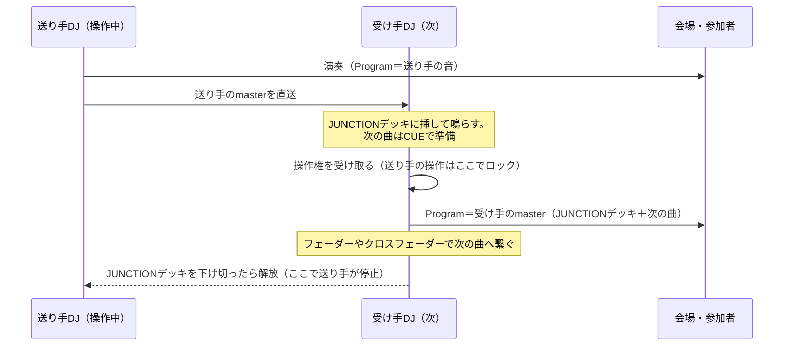
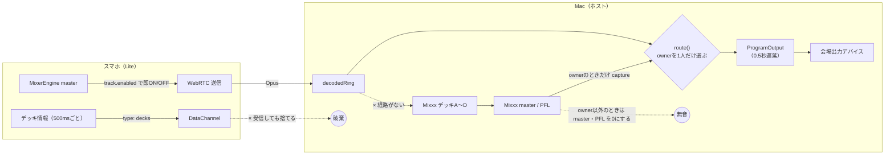
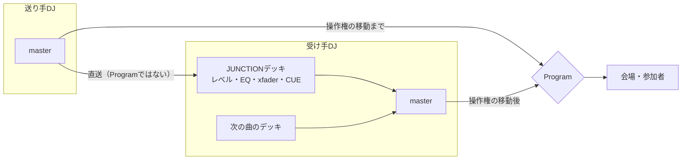
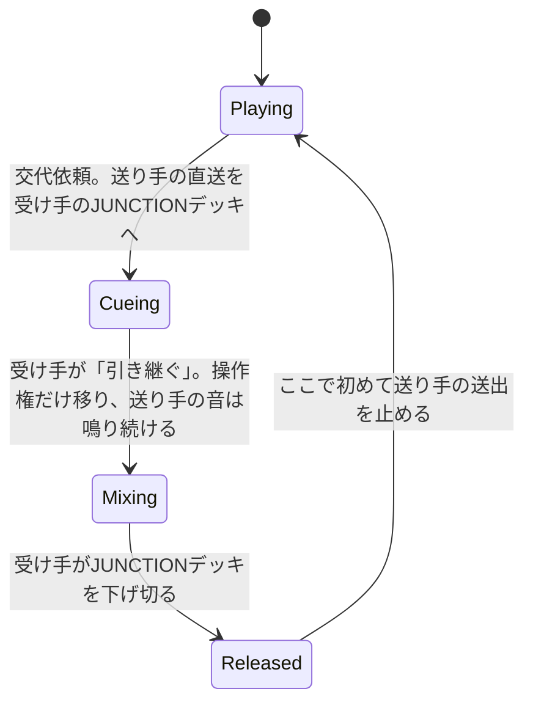
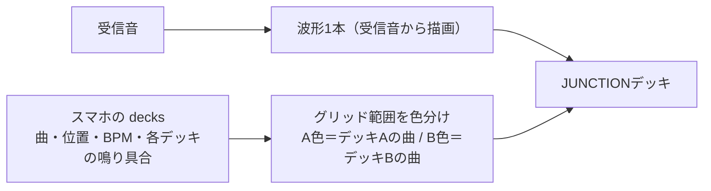
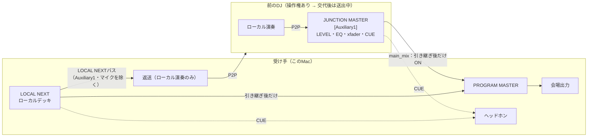

# Junction × PlumDeck Lite：B2Bフローの課題と改善策

対象: plumdeck（Macホスト）＋ share-musics（PlumDeck Lite／スマホ）。調査日 2026-09-15、改訂 2026-09-16。

## 1. 目指すDJフロー

**操作するのは常に1人だけ。前の人の曲は、受け手のデッキ（JUNCTIONデッキ）に挿して鳴らし続け、受け手が音量やクロスフェーダーで次の曲へ繋ぐ。**

操作権の移動と、送り手の音の停止を分けて扱うのがポイントです。操作権は一瞬で移しても構いませんが、送り手の音は受け手が下げ切るまで鳴り続けなければなりません。

## 2. 現状の音声経路（スマホがプレイ中、Macがホストのとき）

## 3. 問題一覧（根本原因）

| # | 症状 | 根本原因 | 該当箇所 |
|---|---|---|---|
| 1 | 「招待を準備しています。できあがるとPlumDeck Lite経由で相手に届きます。」から変わらない | Liteピアの行にも手動招待用の `exchange` が付いたままで、状態が `idle` から更新されない（Liteは別の経路 `liteSdp` / `hello` で接続する）。同じ画面の公開パネルでは「スマホと接続しました」と出ており、表示が食い違う | `runtime.cpp:305`, `:111` / `JunctionRoster.tsx:210` / `exchange-actions.ts:75` / 比較: `ShareMusicsJunction.tsx:224` |
| 2 | 送られてきた音をデッキに挿せない | 受信した音はMixxxに入らず、`route()` から ProgramOutput へ直行する。デッキにロードできるのはファイルパスだけ | `runtime.cpp:1249-1255`, `:1370` / `host.cpp:502-504` |
| 3 | スマホがプレイ中、Macで次の曲を準備できない | owner以外はデッキやミキサーの操作が拒否され、UIでもロードを止めている。さらに **PFL（ヘッドホン）まで0** になる | `authority.cpp:15` / `PlayWorkspace.tsx:284` / `mixxx_backend.cpp:344-346` |
| 4 | 交代した瞬間に前の音がバッサリ切れる | 操作権の移動と音の停止が一体になっている。Liteが関わる交代では `selectLiteOwner()` が即座に切り替え、`programPending.clear()`・キャプチャ停止・epoch++ で旧ownerの音を捨てる。スマホ側も同時に `track.enabled=false` にする | `runtime.cpp:493-503`, `:1703` / `peerConnection.ts:106` / `MixerEngine.ts:196-207` |
| 5 | 次のDJ（スマホ）がMacの音を受け取れない | Mac→LiteのWebRTC回線が受信専用（RecvOnly） | `media_transport.cpp:157` |
| 6 | スマホで何の曲をかけているかがMacに出ない | スマホが500msごとに送る `decks` をMacの `liteControl` が捨てている。Lite側も「デッキA＝現在」「デッキB＝次」と固定で割り当て、`audibility` を常に1にしている | `runtime.cpp:509-510` / `share-musics DjPlayPage.tsx:239`, `JunctionPanel.tsx:219` |
| 7 | 前の曲と次の曲が2枚に分かれて表示され、意味が分かりにくい | Junction Liveを「現在」「次（先読み）」の2枚のカードで見せる設計になっている。しかも表示専用で、音はデッキに入らない | `JunctionTrackList.tsx:17-20` / `PlayWorkspace.tsx:346-356` |
| 8 | 仕様そのものが「1人ずつ切り替える」前提 | FR-29「MASTER OUTへ出すのは常にowner 1人分」 | `share-musics/docs/requirements.md:75,98` |

補足: Mac同士の交代はデッキ状態（graph）ごと引き継ぐので、今でも音は切れません。問題が起きるのはLiteが関わる経路だけです。

## 4. 改善方針

### 4.1 JUNCTIONデッキ

送り手の直送音を、受け手の**デッキ枠の1つ**として扱います。

| 側 | できる操作 | 実体 |
|---|---|---|
| Mac（受け手） | レベルフェーダー、EQ、クロスフェーダーへの割り当て、CUE（PFL）。ライブ音なのでピッチ変更とシークはできない | Mixxxの `EngineAux`（`[Auxiliary1]`）をデッキ枠に表示する。`decodedRing` を分岐（tee）→ ジッタバッファ → ASRC → `receiveBuffer` |
| スマホ（受け手） | レベルフェーダーとクロスフェーダーだけ | `MixerEngine` に MediaStreamSource＋GainNode のチャンネルを追加する |

### 4.2 交代の段階

**継ぎ目の合わせ方**

- **スマホ→Mac**: JUNCTIONデッキのバッファ遅延は自前で決める値なので、既知です。Program側の直送音を同じだけ遅らせてから継げば、相関計測は不要です（見込み）。
- **Mac→スマホ**: スマホは波形で確認できないので、多少のズレは許容します。位置合わせはせず、切り替えの瞬間に短いフェードをかけるだけにします。

### 4.3 JUNCTIONデッキの表示（1本に統合）

「現在再生中」「次の曲（先読み）」の2枚を廃止し、JUNCTIONデッキの波形1本にまとめます。

- 波形は受信したPCMから描きます。スマホ側の曲ファイルは不要です。
- どの範囲が前の曲でどの範囲が次の曲かは、グリッド上の範囲の色で表します。色の判定には、スマホから届くデッキごとの鳴り具合（`レベル × クロスフェーダー`）を使います。そのため、Lite側で固定値になっている `audibility:1` を実際の値に直す必要があります。
- グリッドは、優勢なデッキのBPMと位置から引きます。

## 5. ロードマップ

| 優先 | 内容 | 主な変更点 | 規模 |
|---|---|---|---|
| P0 | 招待表示のバグ修正 | Liteピアには手動の `exchange` を付けない（または `hello` から `connected` を返す）。Roster側もLiteの行は `participant.status` で表示する | 小 |
| P0 | 交代で音を止めない | `selectLiteOwner` から `programPending.clear()` と即時停止を外す。スマホ側は操作権を失っても、解放されるまで送出を続ける（ロックするのは操作だけ） | 小〜中 |
| P1 | スマホのプレイ中もMacで準備できるようにする | ownerがLiteのとき、Macのデッキ操作を「ローカル準備」として許可する。PFLは0にしない（会場へのmasterは引き続きミュート） | 小〜中 |
| P1 | 曲情報を受け取る | `liteControl` で `decks` を受け取る。Lite側は `audibility` を実際の値（レベル×xfader）にし、現在／次の固定割り当てをやめる | 小 |
| P2 | MacのJUNCTIONデッキ（スマホ→Mac） | `EngineAux` の登録と、tee→ジッタバッファ→ASRC の実装。デッキ枠のUI（レベル・EQ・xfader・CUE）と、1本の波形＋範囲の色分け。MCPにも操作を追加する | 大 |
| P3 | スマホのJUNCTIONデッキ（Mac→スマホ） | Lite回線を送受信（SendRecv）にし、Macのローカルmasterを返す。`MixerEngine` にレベルとxfaderだけのチャンネルを追加する。位置合わせはしない | 中〜大 |
| 仕様 | FR-29 の改訂 | 「操作者は常に1人。前の人の音は受け手のJUNCTIONデッキで鳴り続けてよい」 | 小 |

## 6. リスク・要検証

- **フィードバック**: 受け手に返すのは送り手のローカルmasterだけにする（Programは返さない）。自分のJUNCTIONデッキに相手が映っている間、その相手へ自分のmasterを返さないよう、送受信を排他にする。
- **遅延**: Opus・ジッタバッファ・ASRCの合計でおよそ100〜200ms（推測）。スマホ→Macは既知の値で補正できる。Mac→スマホは許容する。
- **パケットロス**: Opusの欠損補間は3フレームまでで、それ以上は無音になる（`media_transport.cpp:112`）。JUNCTIONデッキではアンダーラン時に短いフェードを入れる。
- **スマホの負荷**: 上り下り2本のストリームを扱い、iOS SafariのWeb Audioの制約もある。
- **リアルタイム安全性**: auxへの供給はエンジンの before フック内で行い、ロックもメモリ確保もしない。Mac同士でgraphを書き出すときはauxを除外する。

## 7. 確定仕様（2026-09-16 承認）

本節は4〜6節の「JUNCTIONデッキ」を置き換えます。以降、コード・UI・文書の用語は次の3つに統一します。

| 用語 | 意味 | 呼ばないこと |
|---|---|---|
| **JUNCTION MASTER** | P2Pで届いた**前のDJの現在のMaster音**。ファイルをロードする通常デッキではなく、仮想入力デッキ（Mixxx `[Auxiliary1]`）として扱う | 「次の曲」「DECK B」 |
| **LOCAL NEXT** | 受け手が**これからプレイするローカル曲**（受け手が選んだローカルデッキ） | 「現在」 |
| **PROGRAM MASTER** | 会場へ出す唯一のバス。JUNCTION MASTERとLOCAL NEXTをレベル／CUE／EQ／クロスフェーダーで混ぜた結果 | — |

1. 会場出力はProgram Masterだけにする。受信したP2P音を会場へ直接出さない（操作権を持つ受け手の `local-mix` では実装済み。操作権がまだリモートにある間の `direct-stream` は移行期間のfallbackとして残る。7.1.1節と7.4節を参照）。
2. 送り手へ返すP2P音は、送り手自身のローカル演奏音に限る。Program全体もJUNCTION MASTERも返さない。
3. 操作権の移動と前のDJの送出停止は別の操作にする。受け手がJUNCTION MASTERを下げ切る（LEVEL 0が1.5秒続く）か「前のDJを解放」を押すまで、前のDJの音は止めない。解放されるまで、次のDJは指名できない。
4. プレイヤー画面の常時UIから、JUNCTION MASTERのレベル／CUE、LOCAL NEXTのデッキ選択（ロード先）・再生・CUE、Program Masterのメーター・出力先・ヘッドホンモニター切替、交代操作をすべて操作できる。Junctionパネルを開く必要はない。
5. 接続済みのDJは、演奏希望を出していなくてもホストの候補一覧に表示する。演奏希望は順番への参加操作とする。演奏済みのDJは候補から外さず、再演奏の希望・指名・並び替えができる（ロックするのは演奏中のDJの位置だけ）。
6. 状態表示では、ホスト（管理）／操作権（＝演奏中）／送出中（交代後も鳴っている前のDJ）／次のDJ／演奏希望を別々の表示にする。

### 7.1 音声経路（実装済みの境界）

判定の実体は `native/mixxx-engine-host/src/junction/program_mixer.h` の `ProgramMixerRoute::resolve()` です。Runtimeはこの判定をスナップショットの `programMixer` として公開し（ネットワークには載せない）、ローカル返送の開始もこの判定で許可します。

| 入力 | 出力 |
|---|---|
| `hosting` / `programOpen` / `localOperator` | `venueSource`: `none` / `remote-host` / `direct-stream` / `local-mix` |
| `junctionMasterPresent` / `junctionMasterInMain` | `junctionMaster.inProgram`（操作権があり、かつmainにあるときだけtrue） |
| `localOperator` | `localNext.inProgram` / `localNext.cueOnly` |
| `returnRequested` / `returnRelayed` / `junctionMasterInMain` | `returnFeed.source`: `none` / `local-play` / `relayed-peer`、`feedbackBlocked` |

フィードバック防止は2段で行います。1段目はエンジンで、返送タップはmain（Program Master）ではなく、JUNCTION MASTERを構造的に含まない「LOCAL NEXTバス」から取ります（7.1.1節）。2段目はRuntimeで、LOCAL NEXTバスを持たないエンジン（`junctionLocalReturnBus()` がfalse）では、JUNCTION MASTERがmainにある間は返送そのものを開始しません（`feedbackBlocked`）。スナップショットの `programMixer.returnFeed.tap` は `local-next-bus` / `main-bus` のどちらで返送しているかを示します。

### 7.1.1 実際に音が流れる経路（2026-09-16 実装・実エンジンで検証）

| 経路 | 実体 | リアルタイム制約 |
|---|---|---|
| 受信P2P → JUNCTION MASTER | Opusデコード済み48kHz PCMを、セッションスレッドの `Runtime::route()` → `feedInput()` が `JunctionInput::write()` へ書き込む（SPSC、44.1kHzへASRC） | 書き込み側だけが確保・変換を行う |
| JUNCTION MASTER → `[Auxiliary1]` | SoundManagerのコールバック先頭（`junction::beforeAudio`）で `feedJunctionAux()` が `JunctionInput::read()` を固定長バッファへ読み、`EngineAux::receiveBuffer()` に渡す | ロックなし・確保なし（atomicとseqlockのみ）。ReplayDriverが実時間の処理権を持つブロックだけが読む |
| `[Auxiliary1]` のLEVEL/EQ/CUE/xfader | Mixxx標準の処理。`pregain` → `[EqualizerRack1_[Auxiliary1]_Effect1]`（prefader、`filterLow/Mid/High` はその別名）→ `volume`×クロスフェーダー（`orientation`）→ `main_mix` でcrossfaderバスへ、`pfl` でヘッドホンバスへ | Mixxx内部 |
| JUNCTION MASTER + LOCAL NEXT → PROGRAM MASTER | 引き継ぎ（`selectLiteOwner` の `takeOver`）で `[Auxiliary1] main_mix=1`。Mixxxのmainはローカルデッキ・サンプラー・マイク・JUNCTION MASTERの合計になり、`afterAudio` で `Runtime::capture()` がキャプチャしてProgramOutput（会場）へ出す。`seamFrame` 以降、`route()` は前のDJのP2P音をProgramへ入れない | キャプチャはSPSCリングへのpushのみ |
| LOCAL NEXT → 返送 | ビルド時にEngineMixer::processへ注入するフック（`cmake/target/CMakeLists.txt`）が、crossfaderバス合流直前のpost-fader・post-xfaderのチャンネルバッファを合計する。`[Auxiliary1]`（handle一致）とtalkoverチャンネル（マイク）は除外し、main gainを掛けて `AudioBridge::localReturn` に置く。`afterAudio` はこのバッファだけを `captureLocalReturn()` に渡す | 固定長配列への加算のみ。ロック・確保なし |

マイクを返送から除くのは、会場スピーカーの音（相手のProgramを含む）を拾って相手へ戻す音響ループを避けるためです。

実エンジンでの確認（`manual-runtime.test.mjs` の「JUNCTION MASTER is real engine audio」）：`PLUMDECK_JUNCTION_AUDIO_PROBE=1` のときだけ使える `junction.input.probe`（セッション中は拒否）で1kHzの合成音を `JunctionInput` に流し、エンジンが実際に描いたピーク（`junctionInput.channel.meters` の `programPeak` / `pflPeak` / `localReturnPeak`、約200ms窓）を測ります。

- `main_mix=0`：Auxiliary1のVUは振れるが、Program Masterと返送は無音
- `main_mix=1`：Program Masterに出る。返送バスは無音のまま
- LEVEL 0で無音、戻すと復帰。EQ mid 0で1kHzが1/4未満に減衰し、戻すと復帰
- `orientation=0`（左）でクロスフェーダーを右端にすると無音、THRUに戻すと復帰
- LOCAL NEXT（デッキAのトーン）を再生すると、返送バスにはLOCAL NEXTだけが出る。JUNCTION MASTERのLEVELを上げ下げしても返送ピークは変わらず、LEVEL 0のときProgram MasterとLOCAL NEXTのピークは一致する
- CUE：ヘッドホン出力のあるデバイス（DDJ-1000）ではPFLバスに出ることを確認する。BlackHoleではCUE指定が拒否されることだけを確認する

### 7.2 UI状態

プレイ画面の `JunctionPerformanceStrip`（`src/components/play/JunctionPerformanceStrip.tsx`）は、セッション中は常に表示します。状態の導出は `src/services/junction/program-mixer.ts` にまとめています。

| ステージ | 条件 | 表示 | 主な操作 |
|---|---|---|---|
| `waiting` | JUNCTION MASTERの送り手がいない | 前のDJの音声を待機 | LOCAL NEXTの準備、演奏希望 |
| `cueing` | JUNCTION MASTERを受信中で、操作権がない | CUEで準備中（会場は前のDJ） | JUNCTION MASTER／LOCAL NEXTのCUE、LOCAL NEXTの再生（ローカル準備が許可されている場合）、引き継ぐ |
| `mixing` | 操作権があり、前のDJが送出中 | ミックス中（前のDJの音が残っています） | JUNCTION MASTERを下げる、前のDJを解放 |
| `playing` | 操作権があり、送出中のDJがいない | 演奏中 | 次のDJを指名（ホスト） |
| `sending` | 操作権を渡したが、自分がまだ送出中 | 交代済み・受け手が下げ切るまで送出中 | 待つ（JUNCTION MASTERの操作は不可） |

役割の行には、ホスト／操作権／送出中／次のDJを個別に表示します。Roster側では「待機中」を「接続済み」に、「交代希望」を「演奏希望」に、「演奏済み」を「演奏済み・再演奏可」に改め、「ホスト」「操作権」「送出中」のバッジを付けます。

Program Masterのセル：
- `local-mix` の場合：「会場：このミキサーのProgram Master」と返送状態を表示する。
- `direct-stream` の場合：「引き継ぐまで会場には前のDJの送出音がそのまま出ます」と警告を表示し、未達の経路を隠さない。

### 7.3 候補・再演奏の修正

- 手動交換（manual）のセッションでは、Liteピアの行が未使用の手動交換状態（idle）から `invited` と判定され、候補から外れていました。Liteピアには手動交換の状態を使わないように直しました（3節の#1と同じ根本原因）。
- `rosterStatus` は `requested` を `finished` より先に判定します。演奏済みのDJが再度希望すると「演奏希望」と表示されます。
- `roster.reorder` で固定するのは演奏中のDJだけにしました。

### 7.4 未実装の音声エンジン項目（理由つき）

| 項目 | 現状 | 未実装の理由・必要な作業 |
|---|---|---|
| 引き継ぎ前のProgram Masterを経由した会場出力 | 操作権がリモートにある間は、`route()` がownerのP2Pストリームを遅延つきでProgramOutputへ直送する（`venueSource: direct-stream`）。引き継ぎ後は受け手のMixxx masterをキャプチャしてProgramへ出すので、仕様どおり `local-mix` になる | Mixxxのmainは1本しかない。操作権が無い間にJUNCTION MASTERだけをmainに入れてキャプチャするには、ローカルデッキをmainから外す仕組み（デッキ単位のmain送出ゲート、またはJUNCTION MASTER専用のProgramバス）が必要。さらに、Mac同士のfenced cutover、recovery、backup経路が「Program＝ownerのストリーム」を前提にしているため、それらの境界処理も合わせて変える必要がある。暫定的にバイパスを隠すことはせず、`directStreamBypass` としてUIに表示している |
| Program MasterをヘッドホンでモニターするCUE | ヘッドホンの切替はJUNCTION MASTERとLOCAL NEXTのPFLだけ | Program（0.5秒遅延）をPFLバスへ戻す経路がエンジンに無い |
| Lite（スマホ）側のJUNCTION MASTER／LOCAL NEXT表示と、`audibility` の実測値 | 本リポジトリの対象外 | share-musics側で対応する（5節のP1／P3） |
| Mac同士（Lite以外）の交代でのJUNCTION MASTER | Mac→Macは従来のfenced cutover（Programを `cutoverFrame` で切替）で、`[Auxiliary1]` は使わない。`takeOver` はLite相手のときだけ成立する | Mac同士の受信音は `decodedRing` から `route()` がProgramへ直接入れる前提で、validation／recovery／backupもこの前提に立つ。JUNCTION MASTER化するには、Mac相手のP2P音も `feedInput()` へ流し、cutoverの代わりにseam計測（`TakeoverAnchor`）を使うよう交代手順を置き換える必要がある |
| 引き継ぎ時に受け手から前のLite DJへLOCAL NEXTを返す経路 | 返送が始まるのは「このMacが前のDJで、次がLite DJ」の場合だけ（`startLiteReturn` は `target==auth.local` で何もしない） | 前のLite DJのアプリ側に、返送音をモニターする経路と表示が必要（share-musics側）。エンジン側はLOCAL NEXTバスがあるので、JUNCTION MASTERを混ぜずに返せる |
| 返送のmain段処理 | LOCAL NEXTバスはpost-fader・post-xfaderのチャンネル合計×main gain。mainのエフェクト、talkoverダッキング、マイクは含まない | mainエフェクトを同じコールバックで2本のバッファに掛ける仕組みがMixxxに無い（EngineMixer内のTODOと同じ制約）。マイクは音響ループ防止のため意図的に除外 |
| CUE（PFL）の実音声確認 | テストはBlackHole（2ch）で、ヘッドホン出力が無いためCUE指定の拒否だけを確認 | DDJ-1000など4ch出力の実機で `pflPeak` を確認する（テストは `pflAvailable` のとき自動で検証する） |
| ストリップ内のLOCAL NEXTロードボタン | ストリップではロード先デッキの選択だけを行い、ロード自体はライブラリから行う | ライブラリの選曲状態は `PlayLibrary` の内部状態のため。ドラッグと既存のロード操作でロード先に入る |

### 7.5 テスト

- ネイティブ：`tests/junction/program_mixer_test.cpp`（経路判定6件。LOCAL NEXTバスがあればJUNCTION MASTERがmainにあっても返送できることを含む）、`manual-runtime.test.mjs`（ソース検査の不変条件、実エンジンでのJUNCTION MASTER実音声検証、Lite引き継ぎ時の `programMixer` 遷移）
- UI：`src/services/junction/program-mixer.test.mjs`、`roster-model.test.mjs`（候補・再演奏）。`pnpm junction:test:ui` に追加済み
